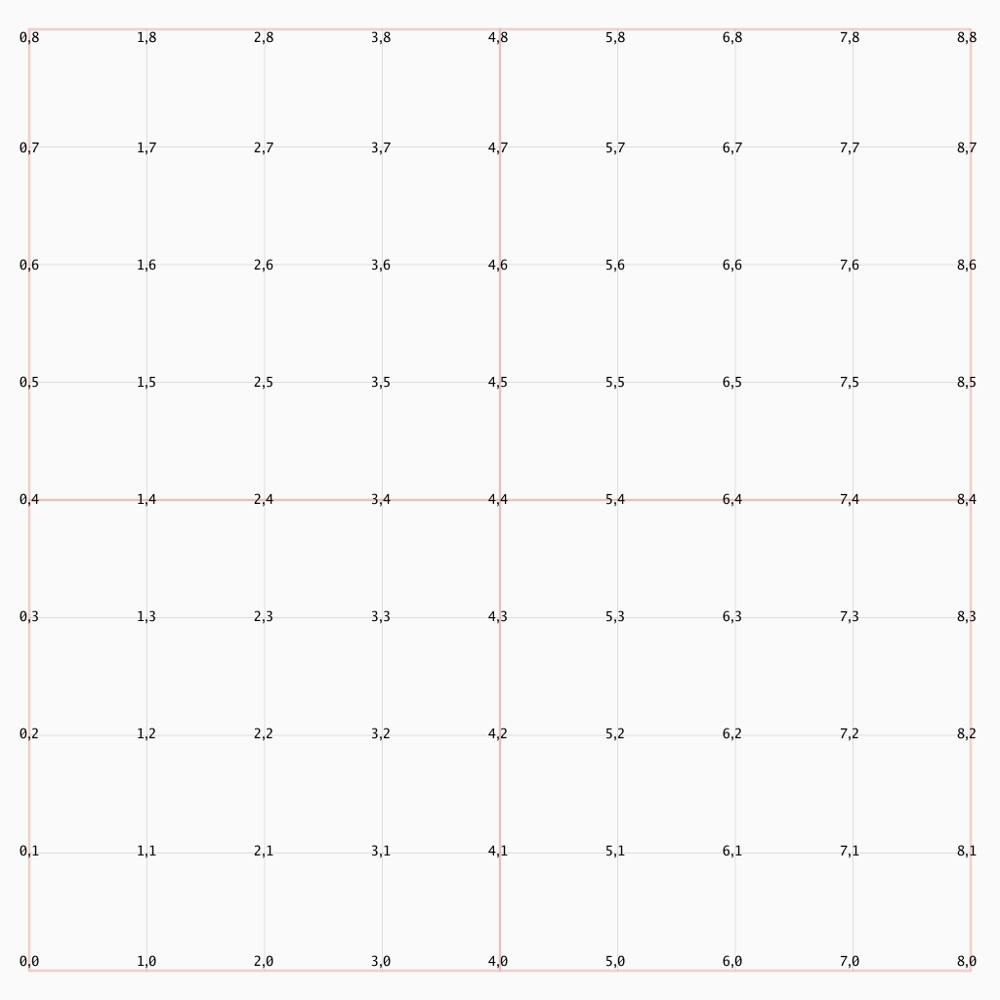
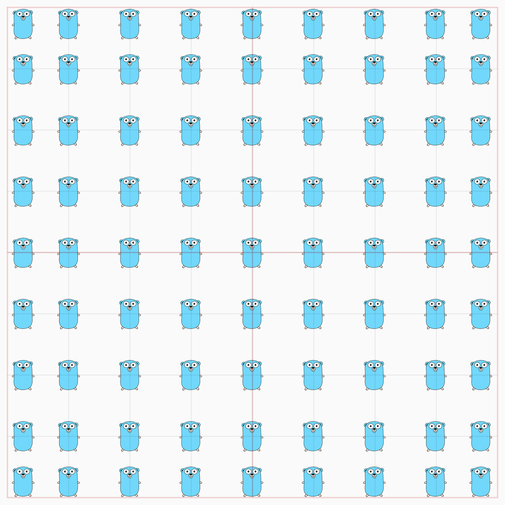

# gridgg - Grid Functions
### For use with Go Graphics [github.com/fogleman/gg](https://github.com/fogleman/gg)  

Grid helper functions assist with simplifying position of images and text using positive grid x, y axis references. For use like a map coordinate system. Ensures images are placed on the canvas (background image layer) in correct alignment and within set padding values. Functions provided for overlaying grid lines and grid reference points. Scales with changing of grid size. gridX and gridY sizes do not need to be equal values. Grids can be 4x4, 8x8, 8x4, 16x8 etc. Demo of image placement and however images align at grid references points included.

### Example Usage - Center Image Placement on Grid
```go
        // For an equal 8x8 grid layout
        // To center an image or text
        // the coordinates would be 4,4
        // im is the previously defined loaded image
        // c is the canvas struct reference passed in

		px, py, ax, ay := setGridPos(c, 4, 4)
		c.ctx.DrawImageAnchored(im, px, py, ax, ay)

```

### Type and Function Summary
```go
// Struct with information about the created image
// canvas or background layer.
type Canvas struct {...

// Initializes various values in Canvas to make
// grid reference calculations simpler.
func (c *Canvas) init() {...

// Draws vertical and horizontal grid lines on Canvas
func drawGridLines(c *Canvas) {...

// Takes in a Canvas and draws grid references at grid axis
// Can also show images at grid reference points
func drawGridRef(c *Canvas, gridText bool, gridImage bool) {...

// Sets start position 0,0 in lower left of image/grid
// Increments positions based on positive passed in x, y values
// Returns values required by gg draw functions
func setGridPos(c *Canvas, x, y int) (px, py int, ax, ay float64) {...
```

### Example of output - text axis reference points.

  

### Example of output - image placement and alignment at each axis point within set padding values.


